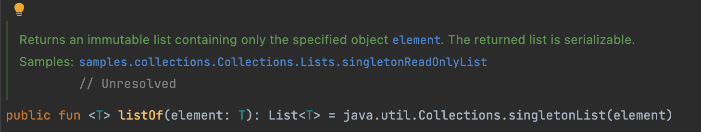

# 아이템 31. 문서로 규약을 정의하라

이름만으로 함수의 내용이 명확하지 않을 때, 순서라던지 명확하게 알려줘야 할 상황이 있을 때

KDoc 주석 사용

```kotlin
/**
* 샬라샬라
* 대부분 영어로 쓰레
* @Param 도 쓸 수 있고
* @Param message: 사용자에게 보여줄 메세지
*/
```

### 규약

규약(contract of an element) : 어떤 행위를 설명하면 사용자는 이를 일종의 약속 취급, 예측되는 행위

만약 규약을 설정하지 않는 다면, 클래스를 사용하는 사람은 스스로 할 수 있는 것과 할 수 없는 것을 모르므로, 구현의 세부적인 정보에 의존하게 되기때문에 규약을 설정하는 것은 중요하다.

### 규약 정의하기

규약 정의하는 방법

- 이름: 일반적인 개념과 관련된 메서드는 이름만으로 동작을 예측할 수 있다. 예를들어 sum 이라는 이름의 메서드가 있다면 문서도 필요없다. 이것은 널리 알려진 개념이기 때문이다.
- 주석과 문서: 필요한 모든 규약을 적을 수 있는 강력한 방법
- 타입: 타입은 객체에 대한 많은 것을 알려준다. 어떤 함수의 선언에 있는 리턴 타입과 아규먼트 타입은 굉장히 큰 의미가 있다. 자주 사용되는 타입의 경우 타입만 보아도 어떻게 사용하는지 알 수 있지만, 일부 타입은 문서에 추가로 설명해야 할 의무가 있다.

### 주석을 써야 할까?

예전: 주석으로 모든 것을 설명하는 문학적 프로그래밍 방식이 인기

지금: 주석 없이도 읽을 수 있는 코드를 작성해야 하는 프로그래밍 방식이 인기

하지만 적절해야 한다!



책에 있는 예제는 아닌데..

뭐 어쨋든 이렇게 코틀린 표준 라이브러리에서도 주석을 쓰고 있고 규약을 잘 정리해주어서 사용자가에게 자유를 준다..!

### KDoc형식

**구조**

- 첫 번째 부분은 요소에 대한 요약 설명(summary description)이다.
- 두 번째 부분은 상세 설명이다.
- 이어지는 줄은 모두 태그로 시작한다. 이러한 태그는 추가적인 설명을 위해 사용된다.

**태그**

- @Param <name> : ‘함수 파라미터'또는 ‘클래스, 프로퍼티, 함수 타입 파리미터'를 문서화 한다.
- @return : 함수의 리턴 값을 문서화
- @Constructor: 클래스의 기본 생성자를 문서화
- @receiver: 확장함수의 리시버를 문서화
- @property <name> : 명확한 이름을 갖고 있는 클래스의 프로퍼티를 문서화. 기본 생성자에 정의된 프로퍼티에 사용
- @throws <class>, @exception <class>: 메서드 내부에서 발생할 수 있는 예외를 문서화
- @sample <identifier> : 정규화된 형식이름(specified qualified name)을 사용해서 함수의 사용 예를 문서화
- @see  <identifier> : 특정한 클래스 또는 메서드에 대한 링크를 추가
- @author : 요소의 작성자를 지정
- @since: 요소에 대한 버전을 지정
- @supress: 이를 지정하면 만들어지는 문서에서 해당 요소가 제외, 외부에서 사용할 수는 있지만, 공식 API에 포함할 필요는 없는 요소를 지정

“설명", “태그를 설명하는 텍스트" 모두 요소, 구체 클래스, 메서드, 프로퍼티, 파라미터를 연결할 수 있다.

관련 요소등에 링크를 걸 때는 대괄호를 사용한다.

만약 링크 대상에 대한 추가 설명을 입력하고 싶을 때는 대괄호를 두번 연속해서 사용한다.

```kotlin
/**
* this is an example descriptions lining to [element1]
*[this element with custom description][element2]
*/
```

모든 것을 설명하는 것보다 짧으면서 명확하지 않은 부분을 자세하게 설명하는 문서가 좋은 문서다

### 타입 시스템과 예측

타입 계층(type hierarchy)은 객체와 관련된 중요한 정보. 

인터페이스는 우리가 구현해야 한다고 약속한 메서드 목록 이상의 의미를 갖는다. 클래스가 어떤 동작을 할 것이라 예측되면, 그 서브클래스도 이를 보장해야 한다 : 리스코프 치환 원칙(Liskov subsitution principle)

: “S가 T의 서브타입이라면, 별도의 변경 없어도 T타입 객체를 S타입 객체로 대체할 수 있어야 한다”

사용자가 클래스의 동작을 확실하게 예측할 수 있게 하려면, 공개 함수에 대한 규약을 잘 지정해야 한다

: 이러한 타입 시스템의 관계도 문서를 통해 전달 할 수 있어야 한다.

### 조금씩 달라지는 세부사항

구현의 세부사항은 항상 달라질 수 있지만, 최대한 많이 보호하는 것이 좋다. 일반적으로 캡슐화를 통해서 이를 보호한다. 캡슐화는 ‘허용되는 범위'를 지정하는 데 ㅁ\도움을 주는 도구다.

캡슐화가 많이 적용될수록, 사용자가 구현에 신경을 많이 쓸 필요가 없어지므로, 더 많은 자유를 갖게 된다.

### 정리

요소, 특히 위부 API를 구현할 때는 규약을 잘 정의해야 한다.

이러한 규약은 이름,문서,주석,타입을 통해 구현할 수 있다. 규약은 사용자가 객체를 사용하는 방법을 쉽게 이해하는 등 요소를 쉽게 예측할 수 있게 해준다.

규약은 요소가 현재 어떻게 동작하고, 앞으로 어떻게 동작할지를 사용자에게 전달해준다. 이를 기반으로 사용자는 요소를 확실하게 사용할 수 있고, 규약에 없는 부분을 변경할 수 있는 자유를 얻는다.

규약은 단순한 합의이지만, 양쪽 모두가 그 합의를 존중한다면 큰 문제가 없을 것이다.